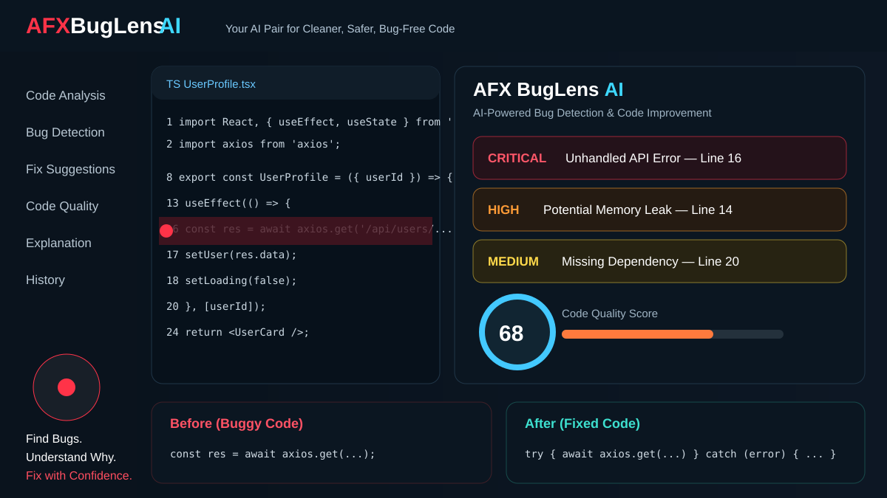
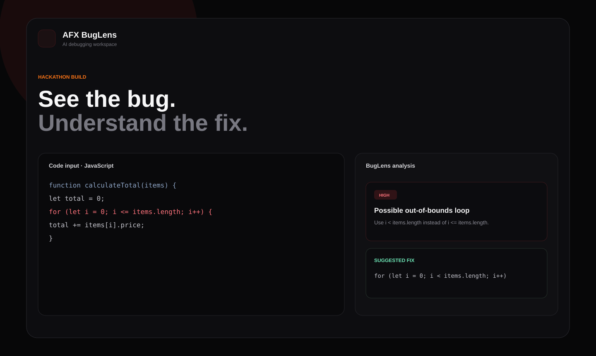
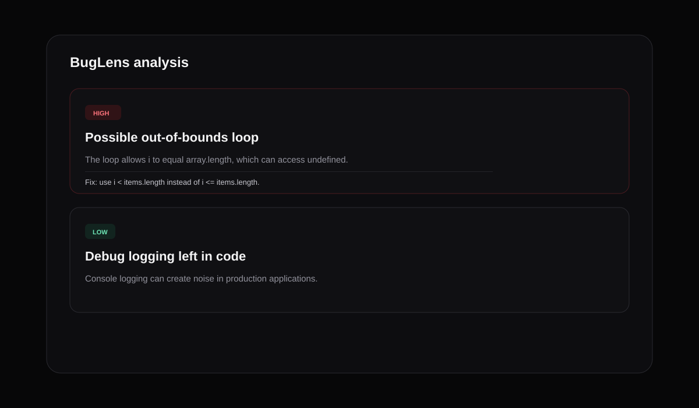
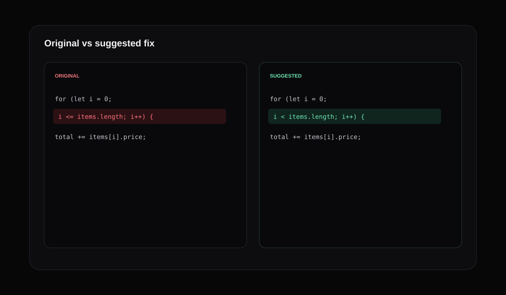

<p align="center">
  
</p>

# 🐞 AFX BugLens AI

> **See the bug. Understand the fix.**

AFX BugLens AI is a hackathon-ready debugging assistant built with **React + TypeScript**. Paste code, choose a language, scan for likely issues, review severity and explanations, then compare the original code with a suggested fix.



## ✨ Features

- React + TypeScript interface
- Multi-language code input
- Fast local demo analyzer for common mistakes
- Severity labels: Critical, High, Medium, Low
- Code quality score
- Bug explanations with line references
- Suggested fixes
- Original vs fixed code comparison
- Copy and download fixed code
- Analysis history during the session
- Responsive dark developer UI
- Netlify/Vercel ready

## 🖼️ Preview

### AI Analysis


### Fix Comparison


## 🧰 Tech Stack

- React
- TypeScript
- Vite
- CSS3
- Lucide React

## 🚀 Run locally

```bash
npm install
npm run dev
```

## 📦 Production build

```bash
npm run build
npm run preview
```

## 🗂️ Project Structure

```text
AFX-BugLens-AI/
├── images/
│   ├── dashboard-preview.svg
│   ├── analysis-preview.svg
│   └── fix-comparison.svg
├── src/
│   ├── App.tsx
│   ├── main.tsx
│   ├── styles.css
│   └── vite-env.d.ts
├── index.html
├── package.json
├── tsconfig.json
├── tsconfig.node.json
├── vite.config.ts
└── README.md
```

## 🧠 Hackathon Extension

The current project includes a deterministic demo analyzer so it works immediately without exposing API keys. Replace `analyzeCode()` with your preferred LLM backend for deeper semantic debugging, repository-aware analysis, and conversational Debug Mode.

## 👨‍💻 Author

Built by **Arfan Shaik** under the AFX project series.
